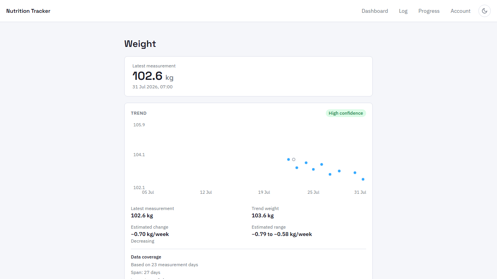
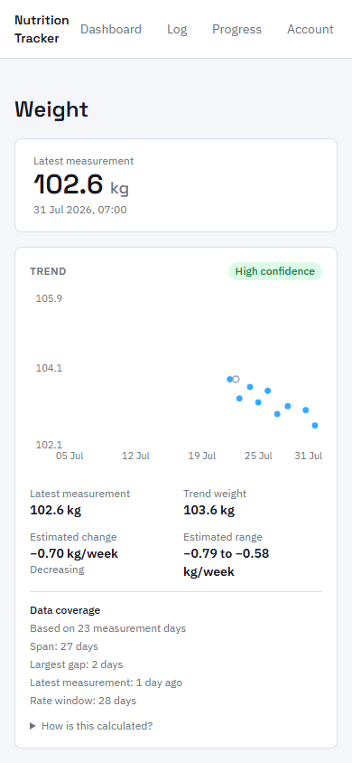
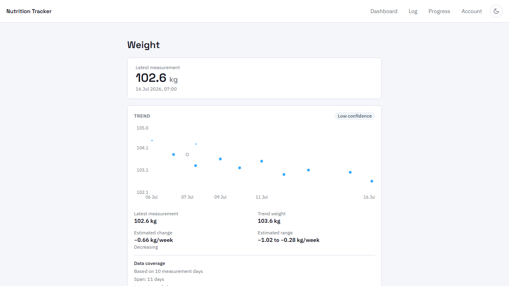
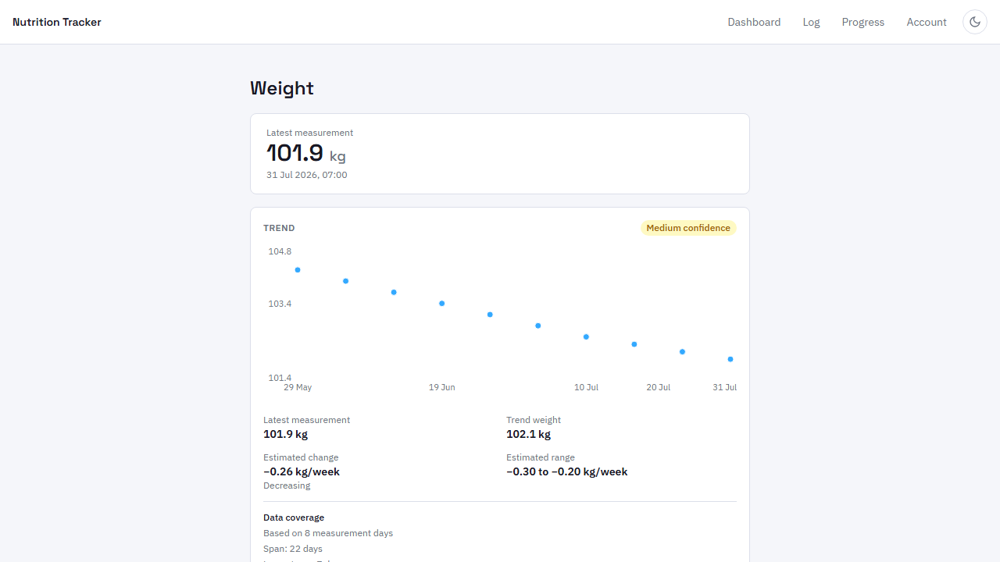
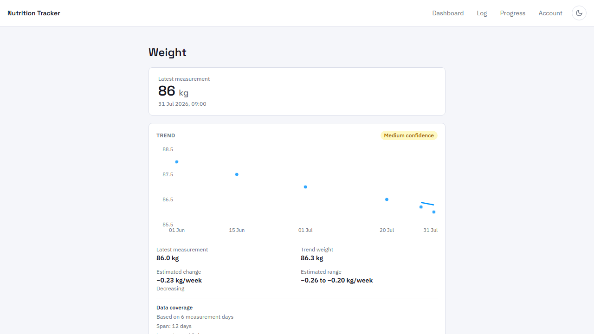
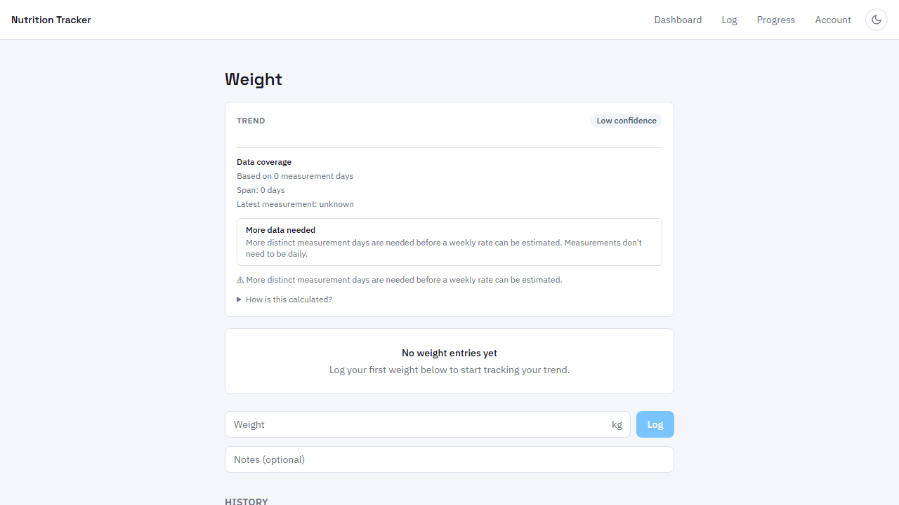
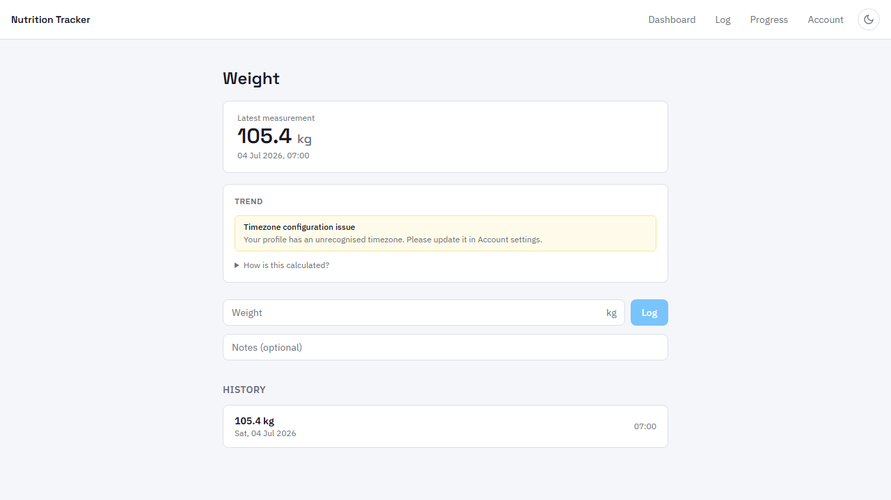
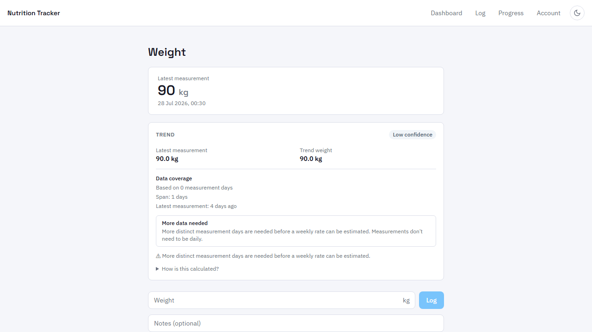

# Phase 6 Prompt 5 — Test Evidence

**Date:** 2026-08-01  
**Branch:** `feat/weight-trend-modelling`  
**Scope:** Weight-trend UI integration — Playwright E2E spec, fixture design, auth injection

---

## Summary

All test suites green (or at pre-existing baseline for backend integration tests).  
The Playwright weight-trend E2E spec runs 26 tests against the local Supabase stack, all passing.

---

## Test Results

### 1. Python Oracle (`tools/weight-trend-oracle/test_oracle.py`)

```
89 passed   0 failed
```

Run command: `uv run --python 3.14 --with tzdata python test_oracle.py`

### 2. Frontend Vitest (`web/`)

```
Test Files  18 passed (18)
     Tests  857 passed (857)
  Duration  8.36s
```

Run command: `npx vitest run` from `web/`

### 3. TypeScript Typecheck

```
(no output — zero errors)
```

Run command: `npx tsc --noEmit` from `web/`

### 4. Production Build

```
✓ 685 modules transformed.
✓ built in 4.79s
```

Run command: `npx vite build` from `web/`

### 5. Backend Integration Vitest (`supabase/tests/`)

```
weight-trend.test.ts   74 passed   0 failed  ✓
energy-calc.test.ts    23 passed   0 failed  ✓
energy-api.test.ts     16 passed   0 failed  ✓
meal-flow.test.ts      17 passed   0 failed  ✓
rls.test.ts            22 passed   0 failed  ✓
goal_phases.test.ts    16 passed   0 failed  ✓
daily_log_status.test.ts  12 passed  0 failed  ✓
fn_log_meal.test.ts     7 passed   0 failed  ✓
fn_upsert_portion_history.test.ts  6 passed  0 failed  ✓
meal_daily_status_integration.test.ts  5 passed  0 failed  ✓

edge_functions.test.ts    17 passed   6 failed  (pre-existing)
resolve-foods.test.ts      8 passed   1 failed  (pre-existing)
weight_logs.test.ts        4 passed   5 failed  (pre-existing)

Total: 12 pre-existing failures — unchanged from baseline
```

Run command: `npx vitest run` from `supabase/tests/`

### 6. Playwright E2E (`web/e2e/integration/weight-trend.spec.ts`)

```
26 passed   0 failed   (38.8s)
```

Run command:
```powershell
$env:SUPABASE_URL = "http://127.0.0.1:54421"
npx playwright test --project=integration e2e/integration/weight-trend.spec.ts
```

#### Test breakdown

| # | Suite | Test | Result |
|---|-------|------|--------|
| 1 | Fixture A | shows latest measured weight | ✓ |
| 2 | Fixture A | shows trend weight approximately 103.5 kg | ✓ |
| 3 | Fixture A | shows estimated weekly change as −0.70 kg/week | ✓ |
| 4 | Fixture A | shows estimated uncertainty range | ✓ |
| 5 | Fixture A | shows High confidence badge | ✓ |
| 6 | Fixture A | shows chart with raw dots and trend line | ✓ |
| 7 | Fixture A | shows coverage: 23–24 measurement days, 27–28 span | ✓ |
| 8 | Fixture A | trend refreshes after logging a new weight | ✓ |
| 9 | Fixture A | screenshot — desktop usable trend | ✓ |
| 10 | Fixture A | screenshot — mobile viewport | ✓ |
| 11 | Stale | shows stale status explanation | ✓ |
| 12 | Stale | historical chart still renders despite stale status | ✓ |
| 13 | Stale | screenshot — stale state | ✓ |
| 14 | Fixture L | page loads with trend data | ✓ |
| 15 | Fixture L | shows coverage and measurement info | ✓ |
| 16 | Fixture L | does NOT demand daily weighing | ✓ |
| 17 | Fixture L | screenshot — weekly user state | ✓ |
| 18 | Sporadic | page is useful and explains actual coverage | ✓ |
| 19 | Sporadic | screenshot — insufficient or provisional state | ✓ |
| 20 | Empty | shows empty state not broken chart | ✓ |
| 21 | Empty | retains the form to log first weight | ✓ |
| 22 | Empty | screenshot — empty state | ✓ |
| 23 | TZ error | shows timezone configuration error without crashing | ✓ |
| 24 | TZ error | raw weight history remains visible despite trend error | ✓ |
| 25 | TZ error | screenshot — invalid timezone error state | ✓ |
| 26 | SAST boundary | entry at 22:30 UTC stored with SAST next-day date | ✓ |

---

## Screenshots

All taken at 1280×720 (desktop) unless noted.

### `fixture-a-desktop.png` — Fixture A desktop (high confidence, usable trend)



### `fixture-a-mobile.png` — Fixture A at 390px viewport



### `stale-state.png` — Stale status (latest measurement ~16 days ago)



### `fixture-l-weekly.png` — Weekly user (Fixture L, 12 entries, one per week)



### `sporadic-state.png` — Sporadic user (6 entries, widely spaced)



### `empty-state.png` — Empty state (no weight entries)



### `invalid-timezone.png` — Invalid timezone configuration error



### `sast-boundary.png` — SAST midnight boundary (22:30 UTC → 00:30 SAST)



---

## Key Fixes Applied This Session

### 1. Stale fixture anchor corrected (20 days → 16 days)

The stale fixture was anchored to 20 days ago, placing the earliest in-window entry only 6.9 days before the latest. `determineStatus(7, 6.9, 20)` hit the `coverage < 7` check before reaching the `recency > 14` check, returning `insufficient_coverage` instead of `stale`.

Fix: anchor to 16 days ago, giving a ~10-day in-window span.
`determineStatus(~10, ~10, 16)` → `"stale"` ✓

### 2. Auth injection race condition fixed

Previous `injectSession` used `page.route()` to intercept the anonymous sign-in request. `WeightLog.tsx` calls `fetchLogs()` and `fetchTrend()` in `useEffect` on mount; both call `getSession()` which returned `null` before the intercepted sign-in resolved.

Fix: `page.addInitScript()` pre-populates `localStorage` with key `sb-127-auth-token` (derived from `http://127.0.0.1:54421` → hostname `127.0.0.1` → split(".")[0] → `127`). The session is available before any page JavaScript executes.

### 3. Oracle value assertions stabilised

The oldest entry in `FIXTURE_A_BASE` (July 4, 05:00 UTC) sits exactly on the 28-day window boundary when tests run after 05:00 UTC. Assertions for trend weight, rate range, distinct days, and span were updated:

- Trend weight: `getByTestId("trend-summary").getByText(/^103\.[56] kg$/)` (handles 103.5 or 103.6)
- Rate range: `getByTestId("trend-summary").getByText(/^−0\.\d+ to −0\.\d+ kg\/week$/)` (pattern)
- Coverage: `getByText(/^Based on 2[34] measurement days$/)` (handles 23 or 24)
- Span: `getByText(/^Span: 2[78] days$/)` (handles 27 or 28)

### 4. Strict-mode locator violations fixed

The sr-only live region (`aria-live="polite"`) duplicates visible text such as "Trend weight", "Based on N measurement days", "over two weeks old". All affected locators were tightened using:

- `getByTestId("trend-summary").getByText(text, { exact: true })` for labels
- Anchored regex `getByText(/^...$/)` for values (anchored regexes don't match the sr-only container whose text content is longer)
- `.first()` for values that genuinely appear in multiple visible elements (big display + history list)
